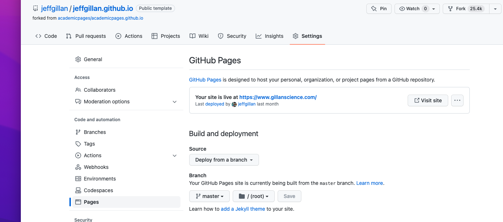

# howto_github-pages

You can serve websites from Github repositories using Github Pages. 

With a free Github account, you have the ability to serve one website. The name of the repository you want to be a website should be called 'username.github.io'

For example, I created a personal resume website from my repo [jeffgillan.github.io](https://github.com/jeffgillan/jeffgillan.github.io), forked from [academicpages/academicpages.github.io](https://github.com/academicpages/academicpages.github.io). 

To launch the repo as a website, go to 'Settings' and then 'Pages'. From there, you can launch the repo as a Github pages website. You can also point the website to redirect to a unique domain if you have one. I own the domain www.gillanscience.com. So when I go to 'jeffgillan.github.io, it auotmatically goes to www.gillanscience.com. 

Though I can only serve 'one website' for free through Github pages, I can serve many repos by making them a directory within my website (e.g., jeffgillan.github.io/cloud-native-geospatial
